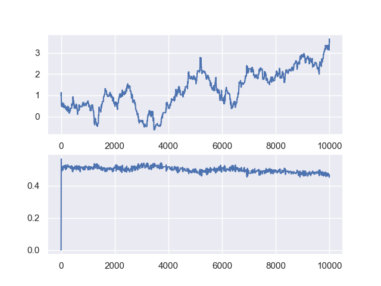

# Newtonian Planet Orbit Modeling using MCMC

This project models the orbits of Newtonian planets using the Markov Chain Monte Carlo (MCMC) method. The implementation uses Python, NumPy for numerical computations, and Matplotlib for data visualization. The code generates a semi-random dataset of test trials informed by the planetary orbit model, enabling comprehensive model testing and verification under various orbital scenarios.

## Features

- **Custom MCMC Simulation**: Implemented a custom MCMC simulation to analyze data with a Stochastic Volatility model.
- **Data Generation**: Generates synthetic data for a linear model representing planetary orbits.
- **Visualization**: Utilizes Matplotlib for plotting data and results.
- **Statistical Analysis**: Uses NumPy for numerical operations and statistical analysis.

## Requirements

- Python 3.x
- NumPy
- Matplotlib
- SciPy
- Seaborn

## Installation

Clone the repository:

```bash
git clone <repository-url>
```

Install the required packages:

```bash
pip install -r requirements.txt
```

## Usage

Run the script:

```bash
python main.py
```

The script will generate synthetic data, run the MCMC simulation, and plot the results.

## Code Explanation

The main steps of the code are as follows:

1. **Importing Libraries**: The code imports necessary libraries including NumPy for numerical operations, Matplotlib for plotting, SciPy for statistical functions, and Seaborn for setting plotting defaults.
2. **Generating Synthetic Data**: The `make_data` function generates synthetic data for a linear model `y = intercept + slope * x` with added Gaussian noise. The function returns the generated data points and their uncertainties.
3. **Defining the Model and Likelihood Functions**:
    - `model`: Defines the linear model `y = intercept + slope * x`.
    - `ln_likelihood`: Computes the log-likelihood of the data given the model parameters using a Gaussian likelihood formula.
4. **Defining the Prior and Posterior Functions**:
    - `ln_prior`: Defines the prior probability of the parameters, assuming a flat prior with a constraint on the slope.
    - `ln_posterior`: Computes the log-posterior probability by combining the prior and likelihood.
5. **Running the MCMC Simulation**: The `run_mcmc` function runs the MCMC simulation to sample from the posterior distribution. It initializes the chain and log-probability, iteratively proposes new parameter values, and accepts/rejects them based on the Metropolis-Hastings criterion.
6. **Running and Plotting the MCMC Results**: The script runs the MCMC simulation with an initial run of 10,000 steps and a longer run of 500,000 steps. It plots the trace of the parameters over the steps to diagnose convergence and plots histograms of the parameter samples to estimate their posterior distributions.

## Results

Below are the results of the MCMC simulation:

### Initial Data Plot


### Trace Plots of Parameters (Initial Run)

 

### Trace Plots of Parameters (Fresh Chain)


### Histogram Plots of Parameters


## Acknowledgements

- This project uses the MCMC method to model planetary orbits.
- Inspired by various resources on Bayesian statistics and MCMC simulations.

Feel free to contribute to this project by opening issues or submitting pull requests. Happy coding!
